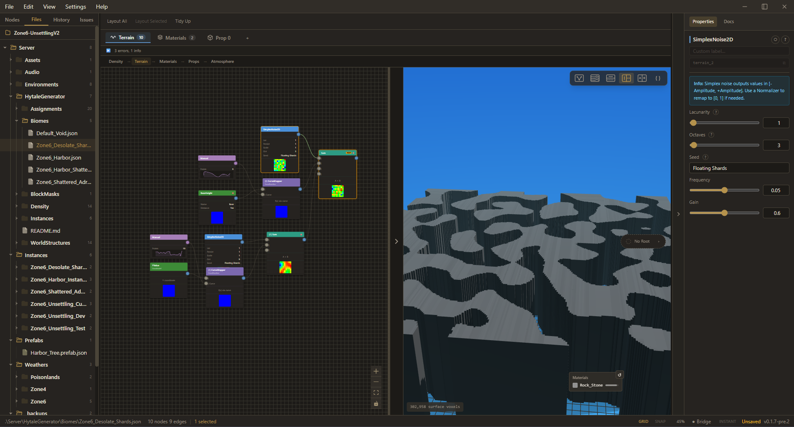
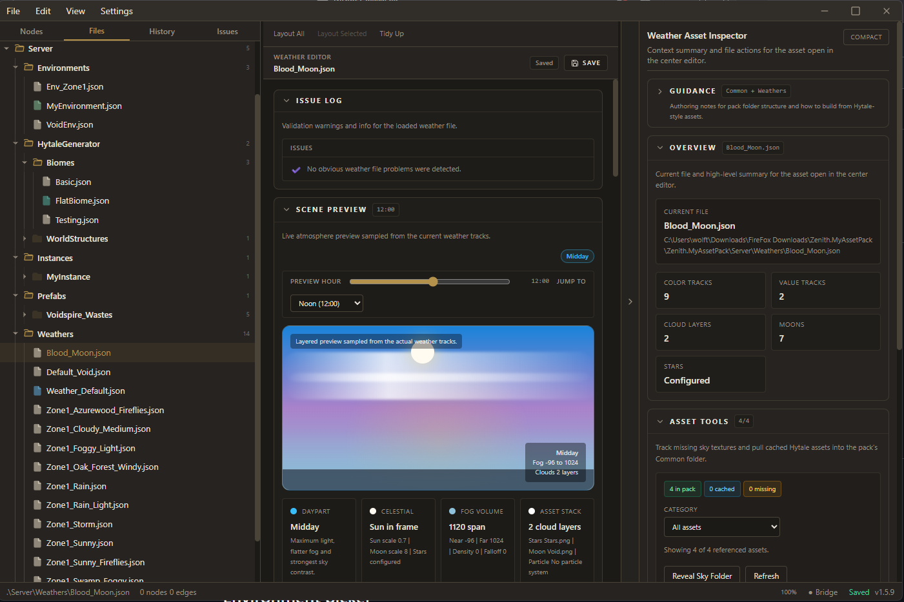

  

  <strong>Creative Technologist • Photographer • Software Engineer</strong>

  Building tools, systems, and platforms at the intersection of technology, storytelling, and design.

---
## Downloads

  
  
  

---

## About

I’m a developer and photographer based in Pennsylvania.

My work focuses on building **procedural systems, creative tools, and web platforms** that prioritize clarity, usability, and real-world impact.

**Areas of focus:**

- Procedural world generation  
- Developer and creative tooling  
- Web platforms and design systems  
- Editorial and documentary photography  

---
## Projects

---

### TerraNova

A terrain generation studio for the Hytale ecosystem, focused on procedural systems and creator tooling.

**Editor & Terrain System**

  

**Environment & Weather System**

  

  
  
  
  

| Focus | Details |
|------|--------|
| Core Systems | Terrain density, biome composition |
| Editor | Node-based terrain + live preview |
| Environment | Weather, lighting, and atmosphere systems |
| Role | Contributor (systems, tooling, UI) |
| Goal | Make complex worldgen accessible to creators |

**Links**
- Download: https://github.com/HyperSystems-Development/TerraNova/releases  
- Repo: https://github.com/HyperSystems-Development/TerraNova  

---

### Abridgd

An open-source news reader focused on clarity and reducing information overload.

  
  
  
  

| Focus | Details |
|------|--------|
| Experience | Clean, distraction-free reading |
| Platform | iOS app (active development) |
| Design | Minimal UI, reduced cognitive load |
| Goal | Improve how people consume information |

**Links**
- App Releases: https://github.com/McCal-Codes/abridgd/releases  
- Repo: https://github.com/McCal-Codes/abridgd  

---

### McCal Media Platform

A custom-built web platform for publishing photography and media.

  
  
  

| Focus | Details |
|------|--------|
| System | Modular component architecture |
| UI | Design-token-driven system |
| Platform | Custom-coded (no CMS) |
| Goal | Full control over content and presentation |

**Links**
- Website: https://mcc-cal.com  
---

## 🛠 Tech Stack

  

  
  
  
  
  
  
  
  

---

### Core

| JavaScript | TypeScript | HTML | CSS | React |
|------------|------------|------|-----|-------|
|  |  |  |  |  |

### Tools

| Git | GitHub | Node.js | VS Code | Figma |
|-----|--------|---------|---------|-------|
|  |  |  |  |  |

### Additional

| Java | C++ | Python |
|------|-----|--------|
|  |  |  |

---

## Photography

I work as a photojournalist and event photographer.

**Published in:**

- The New York Post  
- Pittsburgh Magazine  
- PublicSource  
- Union Progress  
- Technical.ly  

Focus: real-world storytelling, events, and editorial work.

---

## Featured Repository

  

---

## Current Focus

- Expanding TerraNova into a full terrain design tool  
- Developing Abridgd as an open-source reading platform  
- Building scalable web platforms  
- Continuing editorial and documentary photography  

---

## Contact

  

